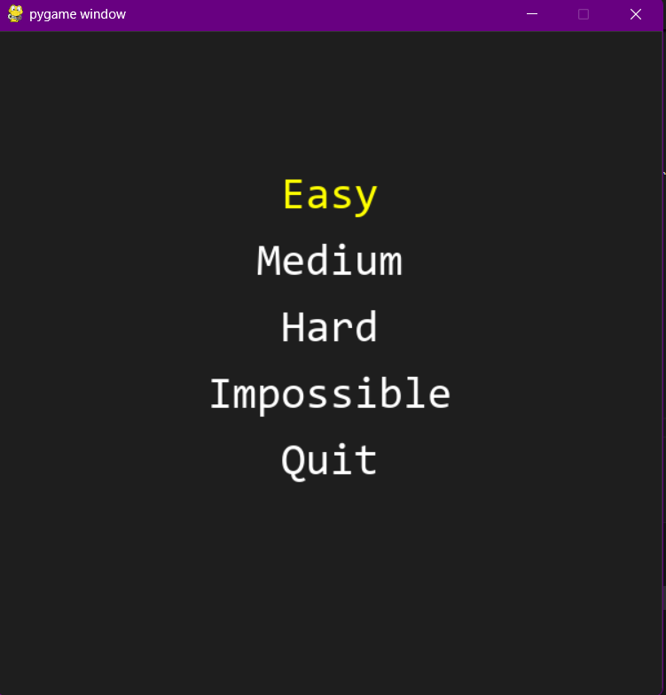
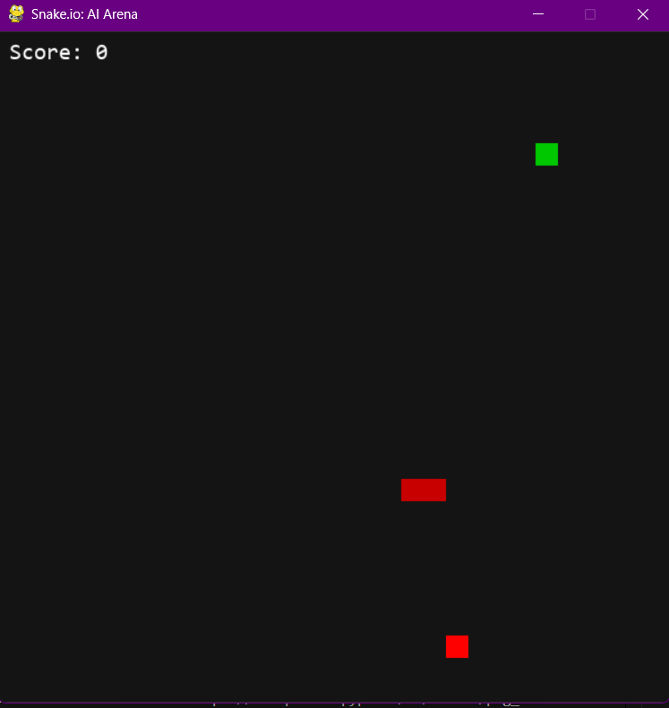
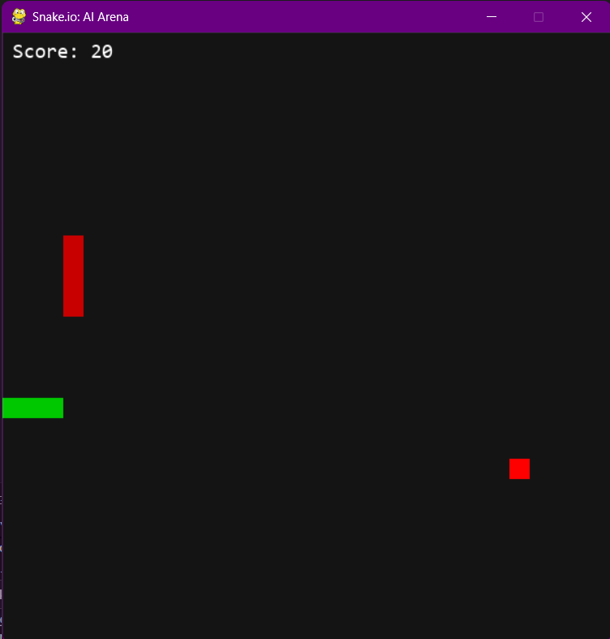

# Snake.io : AI Arena

Ce dépôt contient un prototype du jeu "Snake.io : AI Arena" — un Snake classique étendu avec plusieurs serpents contrôlés par des intelligences artificielles de difficultés différentes. Le projet est organisé pour expérimenter plusieurs approches d'IA : règles simples, recherche d'état (BFS/A*), et modèles entraînés (DQN).

---
# Livrable — Snake.io : AI Arena

Ce document est rédigé selon le cahier des charges joint ("Cahier des charges.pdf") et rassemble le livrable demandé : introduction du projet, pseudocode/logiciel IA, captures d'écran (emplacements), et plan de développement.

---

## 1) Introduction du projet et objectif

Titre : Snake.io — AI Arena

Objectif général : concevoir un prototype de jeu Snake multi-agent où des serpents contrôlés par des intelligences artificielles de difficultés variées s'affrontent dans une arène. Le but pédagogique et technique est d'expérimenter différentes approches d'IA (règles simples, recherche d'états, heuristiques, apprentissage par renforcement) et d'évaluer leur comportement en conditions identiques.

Objectifs spécifiques :
- Implémenter un jeu jouable (Pygame) avec menu, partie et écran de game-over.
- Fournir plusieurs contrôleurs IA (Easy, Medium, Hard, Impossible) et une architecture modulaire pour les tester.
- Préparer un environnement d'entraînement (`snake_env.py`) et un point d'entrée pour entraîner un agent RL (DQN).
- Documenter et livrer un plan de développement et un prototype démontrable.

Public cible : enseignants et étudiants en informatique/IA, développeurs souhaitant expérimenter des agents simples.

Contraintes principales : simplicité, reproductibilité locale (Python + Pygame), modularité du code.

---

## 2) Schéma explicatif / Pseudo‑code IA

Architecture générale (contrat) :

- Entrée : `choose_direction(snake, snakes, food, grid_info)`
- Sortie : vecteur direction `(dx, dy)` parmi `[(0,-1),(0,1),(-1,0),(1,0)]`
- Règle : ne jamais renvoyer l'inversion immédiate de la direction actuelle (pas de reverse instantané)

Pseudocode global (orchestrateur) :

```
main loop:
  for each snake in snakes:
    if snake.is_player: handle player input
    else: snake.direction = snake.ai_controller.choose_direction(snake, snakes, food, grid_info)
  update positions
  check collisions
  draw frame
```

Pseudocode BFS (mentor, utilisé pour `MediumAI`)

```
function bfs_pathfinding(start, goal, grid_width, grid_height):
  queue = deque([start])
  visited = set([start])
  parent = {start: None}

  while queue:
    current = queue.popleft()
    if current == goal:
      path = reconstruct_path(parent, current)
      return path
    for dx,dy in [(-1,0),(1,0),(0,-1),(0,1)]:
      nx = (current.x + dx) % grid_width
      ny = (current.y + dy) % grid_height
      neighbor = (nx, ny)
      if neighbor not in visited:
        visited.add(neighbor)
        parent[neighbor] = current
        queue.append(neighbor)
  return None
```

Pseudocode A* (HardAI — résumé)

```
function astar(start, goal, obstacles, grid_size):
  open_set = priority queue with start
  g_score[start] = 0
  f_score[start] = heuristic(start, goal)
  """README for Snake.io : AI Arena
  # Snake.io : AI Arena

  Ce dépôt contient un prototype du jeu "Snake.io : AI Arena" — un Snake classique étendu avec plusieurs serpents contrôlés par des intelligences artificielles de difficultés différentes. Le projet est organisé pour expérimenter plusieurs approches d'IA : règles simples, recherche d'état (BFS/A*), et modèles entraînés (DQN).

  ---

  ## Livrable — Snake.io : AI Arena

  Ce document rassemble le livrable demandé : introduction du projet, pseudocode/logiciel IA, captures d'écran (emplacements), et plan de développement.

  ---

  ## 1) Introduction du projet et objectif

  Titre : Snake.io — AI Arena

  Objectif général : concevoir un prototype de jeu Snake multi-agent où des serpents contrôlés par des intelligences artificielles de difficultés variées s'affrontent dans une arène. Le but pédagogique et technique est d'expérimenter différentes approches d'IA (règles simples, recherche d'états, heuristiques, apprentissage par renforcement) et d'évaluer leur comportement en conditions identiques.

  Objectifs spécifiques :
  - Implémenter un jeu jouable (Pygame) avec menu, partie et écran de game-over.
  - Fournir plusieurs contrôleurs IA (Easy, Medium, Hard, Impossible) et une architecture modulaire pour les tester.
  - Préparer un environnement d'entraînement (`snake_env.py`) et un point d'entrée pour entraîner un agent RL (DQN).
  - Documenter et livrer un plan de développement et un prototype démontrable.

  Public cible : enseignants et étudiants en informatique/IA, développeurs souhaitant expérimenter des agents simples.

  Contraintes principales : simplicité, reproductibilité locale (Python + Pygame), modularité du code.

  ---

  ## 2) Schéma explicatif / Pseudo‑code IA

  Architecture générale (contrat) :

  - Entrée : `choose_direction(snake, snakes, food, grid_info)`
  - Sortie : vecteur direction `(dx, dy)` parmi `[(0,-1),(0,1),(-1,0),(1,0)]`
  - Règle : ne jamais renvoyer l'inversion immédiate de la direction actuelle (pas de reverse instantané)

  Pseudocode global (orchestrateur) :

  ```
  main loop:
    for each snake in snakes:
      if snake.is_player: handle player input
      else: snake.direction = snake.ai_controller.choose_direction(snake, snakes, food, grid_info)
    update positions
    check collisions
    draw frame
  ```

  Pseudocode BFS (mentor, utilisé pour `MediumAI`)

  ```
  function bfs_pathfinding(start, goal, grid_width, grid_height):
    queue = deque([start])
    visited = set([start])
    parent = {start: None}

    while queue:
      current = queue.popleft()
      if current == goal:
        path = reconstruct_path(parent, current)
        return path
      for dx,dy in [(-1,0),(1,0),(0,-1),(0,1)]:
        nx = (current.x + dx) % grid_width
        ny = (current.y + dy) % grid_height
        neighbor = (nx, ny)
        if neighbor not in visited:
          visited.add(neighbor)
          parent[neighbor] = current
          queue.append(neighbor)
    return None
  ```

  Pseudocode A* (HardAI — résumé)

  ```
  function astar(start, goal, obstacles, grid_size):
    open_set = priority queue with start
    g_score[start] = 0
    f_score[start] = heuristic(start, goal)
    while open_set not empty:
      current = pop lowest f_score
      if current == goal: return reconstruct_path(parent, current)
      for neighbor in neighbors:
        if neighbor in obstacles: continue
        tentative_g = g_score[current] + 1
        if tentative_g < g_score[neighbor]: update parent/g/f and push
    return None
  ```

  ---

  ## 4) Plan de développement (livrable)

  4.1 Fonctionnalités livrées (prototype actuel)

  - Loop de jeu avec Pygame (`main.py`, `game/engine.py`)
  - Menu principal (`game/menu.py`)
  - `Snake`, `Food` (gestion du grid, wrapping), collision & scoring
  - `game/ai/` : `EasyAI`, `MediumAI` (BFS mentor), `HardAI` (A*)
  - Écran Game Over avec bouton retour au menu

  4.2 Fonctionnalités restantes / roadmap

  - Integration de reinforcement learning
  - Ajout des obstacles
  - Amélioration d'`HardAI` : éviter impasses, heuristique plus riche
  - Metrics & logging : courbes d'apprentissage, moyenne de score, export CSV
  - UI : scoreboard, paramètres (vitesse, nb IA)

  4.3 Planning proposé (exemples)

  - Semaine 1 : Medium collision-aware + tests unitaires (2–3 jours)
  - Semaine 2 : HardAI tuning + heuristiques (3–5 jours)

  4.4 Risques & solutions

  - Entraînement long et non déterministe → solution : checkpoints, runs parallèles, monitoring (TensorBoard / CSV)
  - Collisions fréquentes en Multi-agent → prévoir règles de priorité / respawn et métriques de robustesse

  ---

  ## 5) Instructions rapides d’exécution

  Pré-requis : Python 3.x, pip. Exemple d'installation minimale :

  ```powershell
  pip install pygame numpy
  # Pour ML si besoin :
  pip install torch tqdm
  ```

  Pour lancer le jeu :

  ```powershell
  python main.py
  ```

  ---

  ## Screenshots

  Ajoutez des captures d'écran dans le dossier `docs/screenshots/`. Les images référencées ci-dessous sont attendues par le README :

  - `docs/screenshots/gameplay_easy.png` — partie avec l'IA `Easy`
  - `docs/screenshots/gameplay_medium.png` — partie avec l'IA `Medium`
  - `docs/screenshots/gameplay_hard.png` — partie avec l'IA `Hard`
  - `docs/screenshots/menu.png` — écran du menu principal

  Exemples d'insertion d'images (affichées si les fichiers existent) :

  

  

  

  

  Si vous n'avez pas encore les images, vous pouvez les générer localement (Pygame nécessite un affichage) en utilisant le script helper :

  ```powershell
  python scripts/capture_screenshots.py docs/screenshots gameplay_easy
  python scripts/capture_screenshots.py docs/screenshots gameplay_medium
  python scripts/capture_screenshots.py docs/screenshots gameplay_hard
  python scripts/capture_screenshots.py docs/screenshots menu
  ```

  Ensuite, ajoutez les images au dépôt :

  ```powershell
  git add docs/screenshots/*.png
  git commit -m "Add gameplay screenshots"
  git push
  ```

  ---

  Merci — pour toute aide supplémentaire (génération d'un `requirements.txt`, tuning d'IA, ou ajout d'un pipeline d'entraînement), dites-moi ce que vous voulez prioriser.

  """


